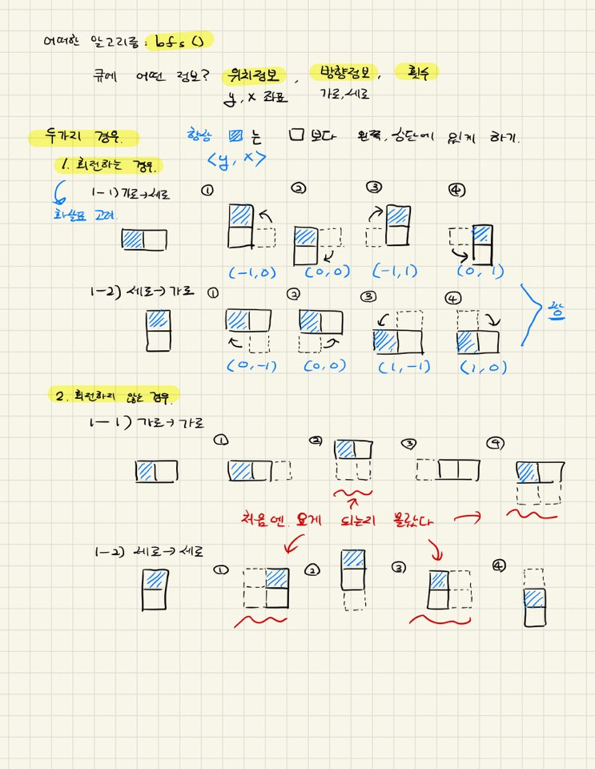

# [2020 카카오 공채] 블록 이동하기

## 문제 알고리즘
- bfs

## 풀이방법
1. bfs를 통한 가능 경로를 탐색한다.
2. 추가적인 코드는 다음의 그림에 기반한다

- 핵심 코드
~~~c++
bool isSafeTurn(vector<vector<int>> board, int y, int x, int dir, int i) {
	if (dir)
		return (board[y + safeTurn[i].first][x + safeTurn[i].second] == 1) ? false : true;
	else
		return (board[y + safeTurn[i].second][x + safeTurn[i].first] == 1) ? false : true;
}

int bfs(vector<vector<int>> board, int y, int x) {
	queue<robot> q;			// queue
	robot t(0, 0, 1, 0);
	q.push(t);
	visited[0][0][1] = true;

	while (!q.empty()) {
		int curY = q.front().y;		int curX = q.front().x;
		int curDir = q.front().dir;	int curCnt = q.front().cnt;
		q.pop();

		// end state
		if (curDir) {	// 가로
			if (curY == N - 1 && (curX + 1) == N - 1)
				return curCnt;
		}
		else {			// 세로
			if ((curY + 1) == N - 1 && curX == N - 1)
				return curCnt;
		}

		// turn case (회전)
		for (int i = 0; i < 4; i++) {
			if (curDir == 1) {	// 가로 -> 세로
				int nextY = curY + turnDir[i].first;
				int nextX = curX + turnDir[i].second;
				int nextDir = (curDir == 0) ? 1 : 0;

				if (0 <= nextY && nextY < N - 1 && 0 <= nextX && nextX < N)
					if (!board[nextY][nextX] && !board[nextY + 1][nextX] && !visited[nextY][nextX][nextDir])
						if (isSafeTurn(board, nextY, nextX, curDir, i)) {
							robot tmp(nextY, nextX, nextDir, curCnt + 1);
							q.push(tmp);
							visited[nextY][nextX][nextDir] = true;
						}
			}
			else {				// 세로 -> 가로
				int nextY = curY + turnDir[i].second;
				int nextX = curX + turnDir[i].first;
				int nextDir = (curDir == 0) ? 1 : 0;

				if (0 <= nextY && nextY < N && 0 <= nextX && nextX < N - 1)
					if (!board[nextY][nextX] && !board[nextY][nextX + 1] && !visited[nextY][nextX][nextDir])
						if (isSafeTurn(board, nextY, nextX, curDir, i)) {
							robot tmp(nextY, nextX, nextDir, curCnt + 1);
							q.push(tmp);
							visited[nextY][nextX][nextDir] = true;
						}
			}
		}

		// go back case (앞뒤로 왔다갔다하는 경우)
		for (int i = 0; i < 4; i++) {
			if (curDir) {		// 가로 -> 가로
				int nextY = curY + goDir[i].first;
				int nextX = curX + goDir[i].second;

				if (0 <= nextY && nextY < N && 0 <= nextX && nextX < N - 1) {
					if (!board[nextY][nextX] && !board[nextY][nextX + 1] && !visited[nextY][nextX][curDir]) {
						robot tmp(nextY, nextX, curDir, curCnt + 1);
						q.push(tmp);
						visited[nextY][nextX][curDir] = true;
					}
				}
			}
			else {				// 세로 -> 세로
				int nextY = curY + goDir[i].first;
				int nextX = curX + goDir[i].second;

				if (0 <= nextY && nextY < N - 1 && 0 <= nextX && nextX < N) {
					if (!board[nextY][nextX] && !board[nextY + 1][nextX] && !visited[nextY][nextX][curDir]) {
						robot tmp(nextY, nextX, curDir, curCnt + 1);
						q.push(tmp);
						visited[nextY][nextX][curDir] = true;
					}
				}
			}
		}
	}
	return -1;	// error code
}
}
~~~

- 코드 특이사항
문제의 특정부분을 잘못이해해서 틀렸다.

